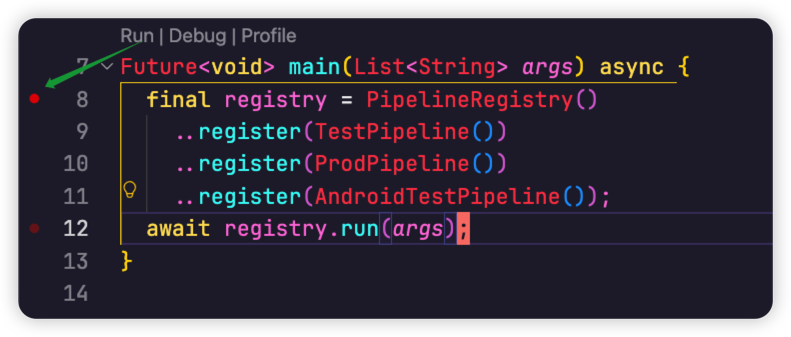
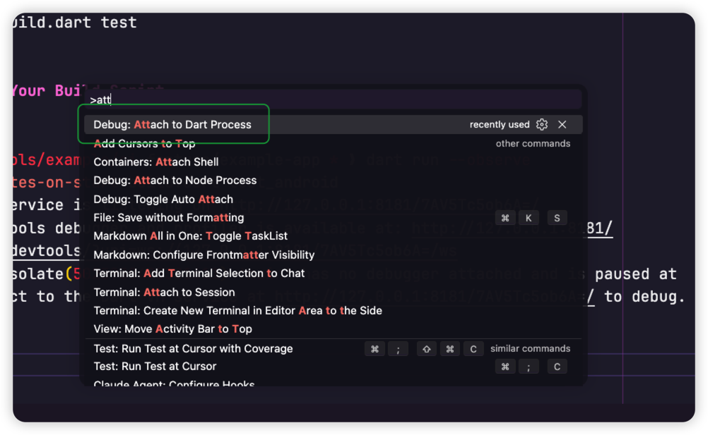
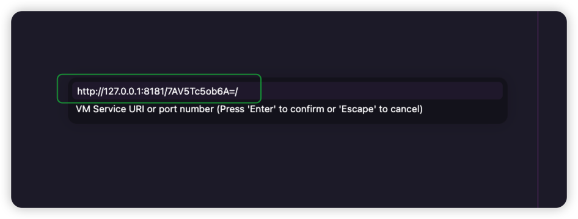
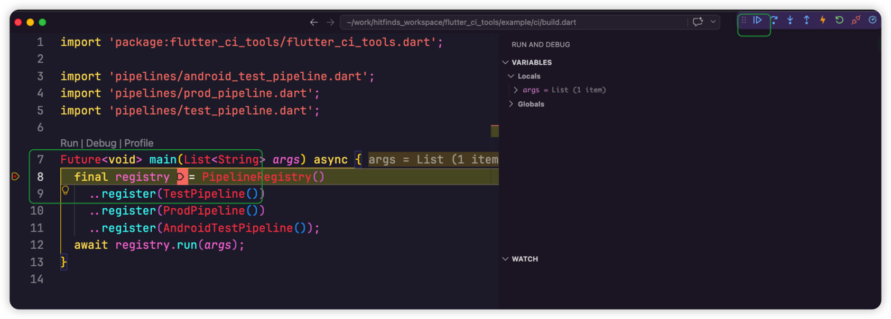

# flutter_ci_tools

Reusable CI tooling for Flutter apps. Provides build orchestration, git-tag-based versioning, deploy services (Pgyer, Feishu, Google Play, App Store), and structured terminal logging.

## Usage

### 1. Add to `pubspec.yaml`

```yaml
dev_dependencies:
  flutter_ci_tools: ^0.1.0
```

### 2. Define your app config

```dart
// ci/my_app_config.dart
import 'package:flutter_ci_tools/flutter_ci_tools.dart';

const myAppConfig = CIToolsConfig(
  appName: 'MyApp',
  seedBuildNumber: 10000,
  pgyerApiKey: 'YOUR_PGYER_KEY',          // optional
  feishuWebhookUrl: 'https://...',        // optional
);
```

### 3. Extend `EnvBuilder`

```dart
class TestEnvBuilder extends EnvBuilder {
  TestEnvBuilder() : super(myAppConfig);

  @override String get envName => 'test';
  @override String get iosExportMethod => 'ad-hoc';
  @override String get apiHost => 'https://api.test.example.com';

  @override
  Future<File> buildAndroid() async { /* flutter build apk ... */ }

  @override
  Future<void> processArtifacts(File apk, File ipa) async {
    await uploadAndNotify(AppPlatform.android, apk);
    await uploadAndNotify(AppPlatform.ios, ipa);
  }
}
```

### 4. Run

```bash
dart run ci/build.dart test
```

### 5. Debug Your Build Script in VS Code

`build.dart` is a plain Dart CLI script, so VS Code's Flutter "Run/Debug"
buttons don't apply. Use the Dart VM Service + **Attach to Dart Process**
workflow instead:

**Step 1 — Set a breakpoint** somewhere in `build.dart` (e.g. the first line
of `main`).



**Step 2 — Launch the script with the VM service enabled and paused at
start**, so the debugger has time to attach before any code runs:

```bash
dart run --observe --pause-isolates-on-start build.dart test_android
```

You'll see output like:

```text
The Dart VM service is listening on http://127.0.0.1:8181/7AV5Tc5ob6A=/
The Dart DevTools debugger and profiler is available at: http://127.0.0.1:8181/7AV5Tc5ob6A=/devtools/?uri=ws://127.0.0.1:8181/7AV5Tc5ob6A=/ws
vm-service: isolate(5025938485331611) 'main' has no debugger attached and is paused at start.
```

Copy the VM service URI (`http://127.0.0.1:8181/7AV5Tc5ob6A=/`).

**Step 3 — In VS Code, open the Command Palette** (`⌘⇧P` / `Ctrl+Shift+P`)
and run **`Debug: Attach to Dart Process`**.



**Step 4 — Paste the VM service URI** from Step 2 and press Enter.



**Step 5 — The debugger attaches and stops at your breakpoint.** Locals,
call stack, and step controls all work as usual.



> Tip: if you only need logs (no breakpoints), drop `--pause-isolates-on-start`
> and just use `dart run --observe build.dart …`. The script runs immediately
> and you can attach at any time.

## API

| Symbol | Description |
|--------|-------------|
| `CIToolsConfig` | App-global config (seed build number, Pgyer/Feishu keys) |
| `EnvBuilder` | Abstract base with full `run()` orchestration |
| `runStep` | Logs + times a pipeline step, rethrows on failure |
| `Logger` | Coloured stdout/stderr output |
| `ShellRunner` | Process runner with live streaming and capture |
| `GitManager` | Git status, branch, hash, commit history |
| `VersionManager` | `builds/*` git-tag-based build numbering |
| `BuildMetadata` | Collects branch/user/hash/commits at build time |
| `DeployService` | Upload to Pgyer, Google Play, App Store; send Feishu messages |
| `AppPlatform` | `android` / `ios` |
| `DeployTarget` | `pgyer` / `googlePlay` / `appStore` |

## Example

A complete consumer demo lives in [`example/`](./example/) — two-env CI
pipeline, all four deploy targets, and a Flutter app that displays its own
build metadata at runtime.
